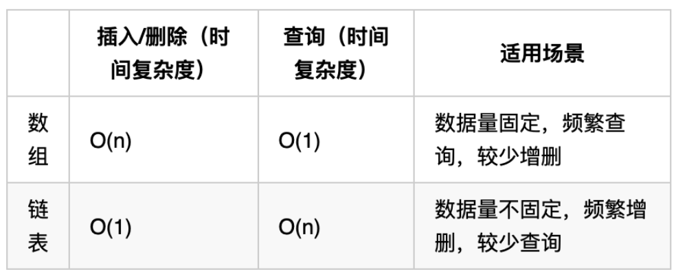

[toc]

# java学习笔记

注意类名要大写

```java
public class Helloworld{
    public static void main(String[] args){
        int year=1949;
    }
}

```

## java八种基本类型
- 整型，4种
- 字符型，1种
- 浮点型，2种
- 布尔型，1种

### 整型
- byte，8位
- short，16位
- int，32位
- long，64位

### 字符型
- char，16位
char类型用于存放一个字符，单引号表示，双引号表示字符串

### 浮点型
- float，32位
- double，64位
小数默认是double类型

### 布尔型
- boolean

### String类型
并不是基本类型

String类型是immutable的，一旦创建就不能被改变

### 字面值
创建一个Hero对象会用到new关键字，但是给一个基本类型变量赋值不适用new。基本类型是java语言里的一种内置的特殊类型，并不是某个类的对象

### 整数字面值
当以l或者L结尾的时候，整数字面值就是long类型，否则就是int类型，建议使用大小，因为小写容易搞混


## 强制转换
高精度向低精度转换需要强制转换

注意可能会溢出
```java
(char) s;
```

低精度向高精度可以直接放进去

注意short，byte，char在进行计算时，会自动转换成int类型

## 变量命名
字母数字$_

变量第一个字符，不能使用数字

## 字段，属性，field
当一个变量被声明在类下面，变量就叫做字段或者属性、成员变量

## final修饰
当一个变量被final修饰的时候，该变量只有一次赋值的机会

## 数组
声明数组
`int[] a`

创建数组
```java
// 声明一个引用
int[] a;
// 创建一个长度是5的数组，并且使用引用a指向该数组
a=new int[5];

int[] b=new in[5];// 声明的同时指向一个数组
```

### 增强型for循环
```java
int values[]=new int[]{1,2,3,4,5};
// 常规for循环
for(int ii=0;ii<values.length;ii++){
    int each=values[ii];
    System.out.println(each);
}
// 增强for循环
for(int each:values){
    System.out.println(each);
}
```

### 幅值数组
数组长度是不可变的，一旦分配好空间，是多长就是多长，不能增加也不能减少

`System.arraycopy(src,srcPos,dest,destPos,length)`

- src：源数组
- scrPos：目标数组
- destPos：复制到目标数组的起始位置
- length：复制的长度

### 二维数组
```java
// 二维数组
int b[][]=new int[][]{
    {1,2,3},
    {4,5,6},
    {7,8,9}
};
```

### 数组方法
1. 数组复制

类似于System.arrycopy，有Arrays.copyOfRange(int[] original,int from,int to)
- 第一个参数表述源数组
- 第二个参数表示开始位置（取的到）
- 第三个参数表示结束位置（取不到）

2. 转化为字符串
不需要通过for诸葛打印了

Arrays.toString()

3. 排序
Arrays.sort()

4. 搜索
查询元素出现位置，使用binarySearch进行查找之前，必须使用sort进行排序

如果数组中油多个相同元素，查找结果不确定

4. 判断是否相等
Arrays.equals(a,b)

5. 填充
Array.fill(a,5)

## 类和对象
如果一个变量的类型是类类型而不是基本类型，那么该变量又叫做引用

`Hero h=new Hero();`


引用有多个，但是对象只有一个

一个引用，同一时间，只能指向一个对象

### 继承
继承类名下的属性以及方法

### 方法重载
方法名一样，但是参数类型不一样，调用时，会根据传递的参数类型及数量，自动调用对应的方法

#### 可变数量的参数
```java
public void test(int ...a)
```

### 构造方法
通过一个类创建一个对象，这个过程叫做实例化

实例化是通过调用构造方法，又叫做构造器实现的

注意构造方法没有返回类型，即使是void

实例化一个对象的时候，必然调用构造方法

```java
public name(){
}
```
默认是无参构造，如果提供了一个有参构造方法，但是没有显式的提供一个无参的构造方法，就没有

#### 构造方法同样可以重载

### this关键字
代表当前对象，可以通过this关键字刚问对象的属性
```java
int a;
// 通过this访问对象的属性
public void changea(){
    this.a=10;
}
```

注意参数名不能使用属性的变量名，会导致得到类中的参数

可以在一个构造方法中，调用另一个构造方法

### 类的传参
分为基本类型和类类型

基本类型传参，在方法内，无法修改方法外的基本类型参数

### 包
将比较接近的类，规划在同一个包下

使用同一个包下的其他类，可以直接使用，但是要使用其他包下的类，必须先import

### 访问修饰符
- private，私有的
- package/friendly/default，不写
- protected，受保护的
- public，公共的

### 类之间的关系


- 自身：指的是Hero自己
- 同包子类：ADHero这个类是Hero的子类，并且和Hero处于同一个包下
- 不同包子类：Support这个类是Hero的子类，但是在另一个包下
- 同包类：GiantDragon这个类和Hero是同一个包，但是彼此没有继承关系
- 其他类：Item这个类，在不同包，也没有继承关系的类

1. private


2. package/friendly/default 不写


3. protected


4. public
任何地方都可以访问


总结


规则
1. 属性通常用private封装起来
2. 方法一般使用public，用于被调用
3. 会被子类继承的方法，通常使用protected
4. package一般新手使用

使用作用范围最小原则，能用private就用private，不行就放大以及，用package，再不行就用protected，最后用public

### 类属性
当一个属性被static修饰的时候，就叫做类属性，又叫做静态属性

当一个属性被声明成类属性，那么所有的对象，都共享一个值

访问类属性
1. 对象.类属性
```java
temo.copyright
```
2. 类.类属性
```java
Hero.copyright
```

### 类方法
类方法：又叫做静态方法

对象方法：又叫做实例方法，非静态方法

访问一个对象方法，必须建立在有一个对象的前提的基础上，访问类方法，不需要对象的存在，直接就访问

规则
1. 如果一个方法里，调用了对象属性，那么这个方法必须设计为帝乡方法
2. 如果方法没有调用任何对象属性，可以考虑设计为类方法

### 属性初始化
对象属性初始有3中
1. 生命该属性的时候初始化
2. 构造方法中初始化
3. 初始化块

类属性初始化有2种
1. 声明改属性的时候初始化
2. 静态初始化块
```java
static{
    a1=1;
    a2=2;
}
```

### 单例模式
指的是一个类，在一个JVM中，只有一个实例存在

#### 饿汉式单列模式
通过私有化构造方法使得该类无法在外部通过new进行实例化

#### 懒汉式单列模式
只有在调用getInstance的时候，才能创建实例

### 枚举类型
```java
public enum Season{
    SPRING,SUMMER,AUTUMN,WINTER
}
```
可以用于switch语句中，将范围限制住

借用增强型for循环，可以方便的便利一个枚举

## 接口与继承
接口大概知道是什么，还不知道有什么用

### 对象转型

在这里，有一个对象`new ADHero`，同时也有一个引用ad
- 对象是有类型的，是ADHero
- 引用也是有类型的，是ADHero

通常情况下，引用类型和对象类型是一样的
```java
package charactor;
public class Hero {
	public String name; 
	protected float hp;
	public static void main(String[] args) {
		ADHero ad = new ADHero();
	}
}
```

#### 子类转父类(向上转型)
当引用类型和对象类型不一致的时候，才需要进行类型转换

类型转换有时候会成功，有时候会失败

简单判别：把右边的当做左边来用，看说得通不
```java
Hero h = new Hero();
ADHero ad = new ADHero();
h = ad;
```
这里说得通

例如苹果手机继承了手机，因此把苹果手机当做普通手机使用是可以的

#### 父类转子类(向下转型)
父类转子类有时候性，有时候不行，必须进行强制转换

强制转换的意思就是转换有风险，风险自行承担

```java
Hero h =new Hero();
ADHero ad = new ADHero();
// h = ad;
ad = (ADHero) h;
```
以上转换可以

```java
Hero h =new Hero();
ADHero ad = new ADHero();
Support s =new Support();
h = s;
ad = (ADHero)h;
```
以上转化不行，从语义上将，把物理攻击英雄，当成辅助英雄来用，说不通，因此会强制转换失败，并且抛出异常

完整代码分析
```java
package charactor;
 
import charactor1.Support;
 
public class Hero {
    public String name; 
    protected float hp;
     
    public static void main(String[] args) {
1.        Hero h =new Hero();
2.        ADHero ad = new ADHero();
3.        Support s =new Support();
         
4.        h = ad;
5.        ad = (ADHero) h;
6.        h = s;
7.        ad = (ADHero)h;
    }
}
```
- 4行，ad当做Hero用，可以，h指向一个ad对象
- 5行，由于此时h已经指向了一个ad对象，因此可以进行adHero强制转换
- 6行，support对象当成Hero用，一定可以，此时h只爱你改一个support对象
- 7行，此时h指向一个support对象，无法转换成ADHero类型


#### 没有继承关系的两个类，相互转换
一定会失败


虽然ADHero和APHero都继承了Hero但是彼此没有相互继承关系

### 重写
子类可以继承父类的对象方法，继承后重复提供该方法，就叫做方法的重写，也叫覆盖override

可以加上`@Override`的注解
```java
@Override
```

### 多态
操作符的多态
- +可以作为算数运算，也可以作为字符串连接

类的多态
- 父类引用指向子类对象

#### 操作符的多态
同一个操作符在不同情境下，具备不同的作用
```java
int i = 5;
int j = 6;
int k = i+j; //如果+号两侧都是整型，那么+代表 数字相加
System.out.println(k);
    
int a = 5;
String b = "5";
String c = a+b; //如果+号两侧，任意一个是字符串，那么+代表字符串连接
System.out.println(c);
```

#### 类的多态
通过重载方法，虽然继承自同一个类，调用同一个方法，但是呈现出不同的状态

##### 类的多态条件
1. 父类(接口)引用指向子类对象
2. 调用的方法有重写

##### 使用与不使用的区别
不使用多态，假设英雄要使用血瓶和魔瓶，就需要为Hero设计两个方法
- uselifepotion
- usemagicpotion

且除了物品，还需要设计很多个方法
- usepuritypotion 净化药水
- useguard 守卫
- useinvisiblepotion 隐身药水

如果用多态，设计一个方法叫做useitem，其参数类型是item，只需要一个方法即可

### 隐藏
与重写类似，方法的重写是子类覆盖父类的对象方法

隐藏式子类覆盖父类的类方法

### super关键字
实例化一个ADHero()，其构造方法会被调用，其父类的构造方法也会被调用，并且是父类构造方法先调用，子类构造方法默认调用父类的无参构造方法

### 超类
Object类是所有类的父类

声明一个类的时候，默认是继承了Object

Object类提供了一个toString方法，因此所有类都有toString方法

System.out.println打印对象就是打印对象的toString返回值

### final
final修饰类，方法，基本类型变量，引用的时候分别有不同的意思

#### final修饰类
当Hero被修饰成fnal的时候，表示Hero不能被继承，其子类会出现编译错误

```java
package charactor;
public final class Hero extends Object{
    String name;
    float hp;
}
```


#### final修饰方法
Hero的useitem方法被修饰成final，那么该方法在ADHero中，不能被重写

#### final修饰基本类型变量
final修饰基本类型变量，表示该变量只有一次赋值的机会

#### final修饰引用
表示该引用只有一次指向对象的机会，但是可以通过引用修改对象的属性值

#### 常量
用于修饰公开，直接访问，不会变化的值

### 抽象类
在类中声明一个方法，这个方法没有实现体，是一个“空”方法，这样的方法叫做抽象方法，修饰符“abstract”。当一个类有抽象方法的时候，改类必须声明为抽象类

Hero.java
```java
package charactor;
public abstract class Hero{
    String name;
    float hp;
    float armor;
    int movespeed;
    public static void main(String[] args){
        public abstract void attact;
    }
}
```
ADHero.java
```java
package charactor;
public class ADHero extends Hero implements AD{
    public void physicattack(){
        System.out.println("进行物理攻击");
    }
    @override
    public void attack(){
        physicattack();
    }
}
```

APHero.java
```java
package charactor;
public class ADHero extends Hero implements AD{
    public void magicattack(){
        System.out.println("进行魔法攻击");
    }
    @override
    public void attack(){
        magicattack();
    }
}
```

ADAPHero.java
```java
package charactor;
public class ADAPHero extends Hero implements AD, AP {
    @Override
    public void attack() {
        System.out.println("既可以进行物理攻击，也可以进行魔法攻击");
    }
    public void magicAttack() {
        System.out.println("进行魔法攻击");
    }
    public void physicAttack() {
        System.out.println("进行物理攻击");
    }
}
```

#### 抽象类可以没有抽象方法
Hero类可以在不提供抽象方法的前提下，声明为抽象类，一旦一个类被声明为抽象类，就不能够被直接实例化

#### 抽象类和接口的区别
区别1：
子类只能继承一个抽象类，不能继承多个
子类可以实现多个接口

### 内部类
1. 非静态内部类
2. 静态内部类
3. 匿名类
4. 本地类
非静态内部类BattleScore“战斗成绩”

#### 非静态内部类
非静态内部类可以在一个类里面定义
```java
package charactor;
public class Hero{
    private String name;
    float hp;
    float armor;
    int movespeed;
    // 非静态内部类，只有一个外部类对象存在的时候，才有意义
    class BattleScore{
        int kill;
        int die;
        int assit;
        public void legendary(){
            if(kill>=8)
                System.out.println(name+"超神！");
            else
                System.out.pintln(name+"尚未超神");
        }
    }

    public static void main(String[] args){
        Hero garen=new Hero();
        garen.name="盖伦";
        // 实例化内部类
        // battlescore对象只有在一个英雄对象存在的时候才有意义
        // 所以其实例化必须建立在一个外部类对象的基础上
        BattleScore score=garen.new BattleScore();
        score.kill=9;
        score.legendary();
    }
}
```

#### 静态内部类
在一个类里面声明一个静态内部类

与非静态内部类不同，静态内部类的实例化，不需要一个外部类的实例为基础，可以直接实例化
语法`new 外部类.静态内部类();`

```java
package charactor;
public class Hero{
    public String name;
    protected float hp;
    private static void battlewin(){
        System.out.prinln("battle win");
    }

    // 敌方水晶
    static class enemycrystal{
        int hp=5000;

        // 如果水晶的血量为0，则宣告胜利
        public void checkifvictory(){
            if(hp==0){
                Hero.battlewin();
                
                // 静态内部类不能直接访问外部类的对象属性
                System.out.println(name+"win this game");
            }
        }
    }

    public static void main(String[] args){
        // 实例化静态内部类
        Hero.enemycrystal crystal=new Hero.enemycrystal();
        crystal.cheifvictory();
    }
}
```
实际上就是外部类.静态内部类

#### 匿名类
匿名类指的是在声明一个类的同时实例化它，是代码更加简洁精炼，通常情况下，要使用一个接口或者抽象类，都必须创建一个子类

有的时候，为了快速使用，直接实例化一个抽象类，并当场实现其抽象方法
```java
package charactor;
public abstract class Hero{
    String name;
    float hp;
    float armor;
    int movespeed;
    public abstract void attack();
    public static void main(String[] args){
        ADHero adh=new ADHero();
        // 通过打印adh，可以看到adh这个对象属于ADHero类
        adh.attack();
        System.out.println(adh);
        Hero h=new Hero(){
            // 当场实现attack方法
            public void attack(){
                System.out.println("新的进攻手段");
            }
        };
        h.attack();
        // 通过打印h，可以看到h这个对象属于Hero$1这么一个系统自动分配的类名
        System.out.println(h);
    }
}
```

#### 本地类
本地类可以理解为有名字的匿名类

内部类与匿名类不一样的是，内部类必须声明在成员的位置，即与属性和方法平等的位置

本地类和匿名类一样，直接声明在代码块里面，可以是主方法，for循环里等等敌方

```java
package charactor;
public abstract class Hero{
    String name;
    float hp;
    float armor;
    int movespeed;
    public abstract void attack();
    public static void main(String[] args){
        // 与匿名类的区别在于，本丁磊有了自定义的类名
        class SomeHero extends Hero{
            public void attack(){
                System.out.println(name+"新的进攻手段");
            }
        }

        SomeHero h=new SomeHero();
        h.nae="地卜师";
        h.attack();
    }
}
```

#### 在匿名类中使用外部的局部变量
在匿名类中使用外部的局部变量，外部的局部变量必须修饰为final

为什么要声明为final，其机制比较复杂

## 数字与字符串
### 装箱拆箱
#### 封装类
所有的基本类型，都有对应的类类型，比如int对应的类是integer，这种类就叫封装类
```java
package digit;
public class TestNumber{
    public static void main(String[] args){
        int i=5;
        // 把一个基本类型的变量，转换为Interger对象
        Integer it=new Integer(i);
        // 把一个Integer对象，转换为一个基本类型的int
        int i2=it.intValue();
    }
}
```

#### Number类
数字封装类有
Byte,Short,Integer,Long,Float,Double

这些类都是抽象类Number的子类


```java
package digit;
public class TestNumber{
    public static void main(String[] args){
        int i=5;
        Integer it=new Integer(i);
        // Integer是Number的子类，所以打印true
        System.out.println(it instanceof Number);
    }
}
```

基本类型转封装类
```java
package digit;
public class TestNumber{
    public static void main(String[] args){
        int i=5;

        // 基本类型转换成疯转类型
        Integer it=new Integer(i);
    }
}
```

封装转基本类型
```java
package digit;
public class TestNumber{
    public static void main(String[] args){
        int i=5;

        // 基本类型转换成封装类型
        Integer it=new Integer(i);

        // 封装类型转换成基本类型
        int i2=it.intValue();
    }
}
```
自动装箱

不需要调用构造方法，通过=符号自动把基本类型转换为类类型就叫做装箱
```java
package digit;
public class TestNumber{
    public static void main(String[] args){
        int i=5;

        // 基本类型转换成疯转类型
        Integer it=new Integer(i);

        // 自动转换就叫装箱
        Integer it2=i;
    }
}
```
同理有自动拆箱

#### int最大值，最小值
int的最大值可以通过其对应的封装类integer.MAX_VLAUE获取


### 字符串转换
#### 数字转字符串
方法1：使用String类的静态方法valueOf
方法2：先把基本类型装箱为对象，然后调用对象的toString
```java
i=5;
String str=String.valueOf(i);
Integer it=i;
String str2=it.toString();
```

#### 字符串转数字
调用Integer的静态方法parseInt
```java
String str="999";
int i=Interger.parseInt(str);
```

### 数学方法
java.lang,Math提供了一些常用的数学运算方法，并且都是以静态方法的形式存在

```java
// 四舍五入
Math.round();
// 得到一个0-1之间的随机浮点数（取不到1）
Math.random();
// 得到一个0-10之间的随机整数(娶不到10)
(int)(Math.random()*10);
// 开放
Math.sqrt();
// 次方
Math.pow(2,4);
```

### 格式化输出
如果不适用格式化输出，就需要进行字符串拼接，如果变量比较多，拼接就会显得很繁琐，使用格式化输出，就可以简洁明了

```java
// 直接使用+进行字符串连接
String sentence=name+"在";
// 使用格式化输出
String sentenceformat="%s在进行了%d次";
System.out.printf(sentenceformat,name,kill);
```

#### printf和format
printf和format能够达到一模一样的效果
```java
System.out.printf();
System.out.format();
```

### 字符
保存一个字符的时候使用char

char对应的封装类是character

#### character常见方法
```java
Character.isLetter('a');// 判断是否为字母
Character.isdigital('a');// 判断是否为数字
Character.isWhitspace('a');// 判断是否为数字
Character.isUpperCase('a');// 判断是否为大写
Character.isLowerCase('a');// 判断是否为小写

Character.toUpperCase('a');// 转换为大写
Character.toLowerCase('a');// 转换为小写
```

### 字符串
java中字符串是一个类，因此我们见到的字符串都是对象

```java
// 遇到字面值的时候会创建一个字符串对象
String garen="盖伦";

// 创建了两个字符串对象
String teemo=new String("提莫");
```

#### immutable
指不可变的
- 不能增加或减少长度
- 不能插入或删除字符
- 不能修改字符

#### 字符串长度
通过length方法
`name.length()`

### 操纵字符串
- `charAt(int index)`获取指定位置的字符串
- `toCharArray()`获取对应的字符数组
- `subString`截取子字符串
- `split`根据分隔符进行分割
- `trim`去掉收尾空格
- `indexOf`判断字符或者字符串出现的位置
- `contains`是否包含子字符串
- `replaceAll`替换所有
- `replaceFirst`只替换第一个

### 比较字符串
#### 是否是同一个对象
```java
String str1="the light";
String str2=new String(str1);
// ==用于判断是否是同一个字符串对象
System.out.println(str1==str2);
```
特例
```java
str1="the light";
str2="the light";
```
由于编译器发现有现成的"thelight"，因此没有重复创建

#### 比较内容是否相同
equals

equalsIgnoreCase忽略大小写判断内容是否一致

#### 开头结尾
- `startsWith()`
- `endsWith()`

### StringBuffer
可变长的字符串
```java
StringBuffer sb=new StringBuffer("test");

// 追加
sb.append("123");

// 删除2-4之间的字符
sb.delete(2,4);

// 插入4位置插入here
sb.insert(4,"here");

// 翻转
sb.reverse();
```

## 日期
### 日期Data

data类是java.util.Data而不是java.sql.Data


## ACM输入输出模板
1. 多行输入，每次输入两个整数
```java
import java.lang.*;// 默认的
import java.util.*;

public class Main(){
    public static void main(String[] args){
        Scanner sc=new Scanner(System.in);
        while(sc.hasNextInt(){
            int a=sc.nextInt();
            int b=sc.nextInt();
        })
    }
}
```
2. 多组数据，第一行为n，之后输入n行两个整数
```java
import java.util.Scanner;

public class Main{
    public static void main(String[] args){
        Scanner sc=new Scanner(System.in);
        while(sc.hasNext()){
            int n=sc.nextInt();
            // 先比较再-
            while(n-->0){
                int a=sc.nextInt();
                int b=sc.nextInt();
            }
        }
    }
}
```
3. 输入若干行，每行输入两个整数，遇到特定条件为止
```java
import java.util.Scanner;
public class Main{
    public static void main(String[] args){
        Scanner sc=new Scanner(System.in);
        while(sc.hasNext()){
            int a=sc.nextInt();
            int b=sc.nextInt();
            if(boolean a){
                break;
            }
        }
    }
}
```

4. 若干行输入，遇到0中值，每行第一个数为N，表示本行后面有N个数
```java
import java.util.Scanner;
public class Main{
    public static void main(String[] args){
        Scanner sc=new Scanner(System.in);
        while(sc.hasNext()){
            int n=sc.nextInt();
            if(n==0){
                break;
            }
            int sum=0;
            for(int ii=0;ii<n;ii++){
                sum+=sc.nextInt();
            }
        }
    }
}
```
5. 若干行输入，每行包括两个整数a和b，由空格分隔，每行输出后接一个空行
```java
import java.util.Scanner;
public class Main{
    public static void main(String[] args){
        Scanner sc=new Scanner(System.in);
        while(sc.hasNextLine()){
            int a=sc.nextInt();
            int b=sc.nextInt();
            System.out.println(a+b);
            System.out.println();
        }
    }
}
```
6. 多组n行数据，每行先输入一个整数N，然后在同一行内输入M个整数，每组输出之间输出一个空行
```java
import java.util.Scanner;
public class Main{
    public static void main(String[] args){
        Scanner sc=new Scanner(System.in){
            while(sc.hasNextLine()){
                int N=sc.nextInt();
                // 每组有n行数据
                while(n-->0){
                    int m=sc.nextInt();
                    int sum=0;
                    while(m-->0){
                        sum+=sc.nextInt();
                    }
                    System.out.println(sum);
                    if(N>0){
                        System.out.println();
                    }
                }
            }
        }
    }
}
```


## 时间复杂度
计算时间复杂度一般拿循环次数作为评判标准

1. 如果一个算法的时间复杂度是一个常数，我们都用$O(1)$表示
2. 由于时间复杂度本身便是估算程序运行时间的，因此我们仅保留最高阶项
> 一个程序的基本操作的执行次数是$n^2+n+10$，它的时间复杂度是$O(n^2)$

> 另外有些算法的时间复杂度存在最好，平均和最坏的情况
> 例如在一个长度为N的数组中搜索一个数据x
> 最好情况：1次找到
> 最坏情况：N次找到
> 平均情况：N/2次找到
> 实际中一般关注的是算法最坏运行的情况
> 因此时间复杂度为$O(n)$


## 代码随想录
### 数组

- 数组下标从0开始
- 数组内存空间地址连续

#### 二分查找
```
输入: nums = [-1,0,3,5,9,12], target = 9     
输出: 4       
解释: 9 出现在 nums 中并且下标为 4  
```

给定一个 n 个元素有序的（升序）整型数组 nums 和一个目标值 target  ，写一个函数搜索 nums 中的 target，如果目标值存在返回下标，否则返回 -1。

示例 1:
```
输入: nums = [-1,0,3,5,9,12], target = 9     
输出: 4       
解释: 9 出现在 nums 中并且下标为 4   
```  
示例 2:
```
输入: nums = [-1,0,3,5,9,12], target = 2     
输出: -1        
解释: 2 不存在 nums 中因此返回 -1    
```    
提示：

- 你可以假设 nums 中的所有元素是不重复的。
- n 将在 [1, 10000]之间。
- nums 的每个元素都将在 [-9999, 9999]之间。

```java
class Solution{
    public int search(int[] nums,int target){
        if(target<nums[0] || target>nums[nums.length-1]){
            return -1;
        };

        int left=0;int right=nums.length-1;
        int index=0;
        while(true) {
            int mid=(int)Math.ceil((left+right)/2);
            if(left>=right-1){
                if(nums[left]==target){
                    index=left;
                    break;
                }
                else if(nums[right]==target){
                    index=right;
                    break;
                }else{
                    index=-1;
                    break;
                }
            }
            if(target<=nums[mid]){
                right=mid;
            }
            else{
                left=mid+1;
            }
        }
        return index;
    }
}
```
优化
```java
class Solution{
    public int search(int[] nums,int target){
        int left=0;
        int right=nums.length-1;
        while(left<=right){
            int mid=(left+right)/2;
            if(target<nums[mid]){
                right=mid-1;
            }else if(target>nums[mid]){
                left=mid+1;
            }else{
                return mid;
            }
        }
        return -1;
    }
}
```

#### 移除元素
数组的元素在内存地址中是连续的，不能单独删除数组中的某个元素，只能覆盖
```java
class Solution {
    public int removeElement(int[] nums, int val) {
        int count=0;
        int ii;
        int forcount;
        for(forcount=0;forcount<nums.length;forcount++){
            ii=forcount-count;
            if(nums[ii]==val){
                for(int jj=ii+1;jj<nums.length-count;jj++){
                    int temp=nums[jj];
                    nums[jj-1]=temp;
                }
                count=count+1;
                ii--;
            }
        }
        return nums.length-count;
    }
}
```

答案
```java
class Solution {
    public int removeElement(int[] nums, int val) {
	// 暴力法
        int n = nums.length;
        for (int i = 0; i < n; i++) {
            if (nums[i] == val) {
                for (int j = i + 1; j < n; j++) {
                    nums[j - 1] = nums[j];
                }
                i--;
                n--;
            }
        }
        return n;
    }
}
```
```java
class Solution {
    public int removeElement(int[] nums, int val) {
        // 快慢指针
        int slowIndex = 0;
        for (int fastIndex = 0; fastIndex < nums.length; fastIndex++) {
            if (nums[fastIndex] != val) {
                nums[slowIndex] = nums[fastIndex];
                slowIndex++;
            }
        }
        return slowIndex;
    }
}
```

#### 有序数组的平方
给你一个按非递减顺序 排序的整数数组nums，返回每个数字的平方组成的新数组，要求也按非递减顺序排序。

示例 1：
```
输入：nums = [-4,-1,0,3,10]
输出：[0,1,9,16,100]
解释：平方后，数组变为 [16,1,0,9,100]，排序后，数组变为 [0,1,9,16,100]
```
示例 2：
```
输入：nums = [-7,-3,2,3,11]
输出：[4,9,9,49,121]
```

暴力搜索
```java
class Solution {
    public int[] sortedSquares(int[] nums) {
        for(int i=0;i<nums.length;i++){
            nums[i]=nums[i]*nums[i];
        }
        Arrays.sort(nums);
        return nums;
    }
}
```
双指针
```java
class Solution {
    public int[] sortedSquares(int[] nums) {
        int preindex=0;
        int lastindex=nums.length-1;
        int result[]=new int[nums.length];
        for(int ii=0;ii<nums.length;ii++){
            if(nums[preindex]*nums[preindex]>nums[lastindex]*nums[lastindex]){
                result[nums.length-ii-1]=nums[preindex]*nums[preindex];
                preindex=preindex+1;
            }else{
                result[nums.length-ii-1]=nums[lastindex]*nums[lastindex];
                lastindex=lastindex-1;
            }
        }
        return result;
    }
}
```

#### 长度最小的子数组
给定一个含有 n 个正整数的数组和一个正整数 s ，找出该数组中满足其和 ≥ s 的长度最小的 连续 子数组，并返回其长度。如果不存在符合条件的子数组，返回 0。

示例：
```
输入：s = 7, nums = [2,3,1,2,4,3]
输出：2
解释：子数组 [4,3] 是该条件下的长度最小的子数组。
```
提示：
```
1 <= target <= 10^9
1 <= nums.length <= 10^5
1 <= nums[i] <= 10^5
```
暴力搜索，会超过时间限制
```java
class Solution {
    public int minSubArrayLen(int target, int[] nums) {
        // 暴力解法
        int len=1;
        int sumdat=0;
        for(int ii=0;ii<nums.length;ii++,len++){
            for(int jj=0;jj<nums.length-len+1;jj++){
                sumdat=sumarray(Arrays.copyOfRange(nums,jj,jj+len));
                if(sumdat>=target){
                    return len;
                }
            }
        }
        return 0;
    }
    public int sumarray(int[] nums){
        int sum=0;
        for(int element:nums){
            sum=sum+element;
        }
        return sum;
    }
}
```
双指针，滑动窗口
答案
```java
class Solution{
    public int minSubArrayLen(int s,int[] nums){
        int left=0;
        int sum=0;
        int result=Integer.MAX_VALUE;
        for(int right=0;right<nums.length;right++){
            sum+=nums[right];
            while(sum>=s){
                result=Math.min(result,right-left+1);
                sum=sum-nums[left++];
            }
        }
        return result==Integer.MAX_VALUE?0:result;
    }
}
```

#### 螺旋矩阵
给定一个正整数 n，生成一个包含 1 到 n^2 所有元素，且元素按顺时针顺序螺旋排列的正方形矩阵。

示例:
```
输入: 3 输出: [ [ 1, 2, 3 ], [ 8, 9, 4 ], [ 7, 6, 5 ] ]
```
通过四个边界的方式
```java
class Solution {
    public int[][] generateMatrix(int n) {
        int[][] result=new int[n][n];
        int ucount=0,dcount=0,lcount=0,rcount=0;
        int count=1;
        int ii=0,jj=0;
        boolean ifup=true,ifri=true;
        while(true){
            // 上下排布
            if(ifup){
                for(jj=lcount;jj<=n-rcount-1;jj++){
                    result[ii][jj]=count;
                    count++;
                }
                ucount++;
                jj--;
            }else{
                for(jj=n-rcount-1;jj>=lcount;jj--){
                    result[ii][jj]=count;
                    count++;
                }
                dcount++;
                jj++;
            }
            ifup=!ifup;
            if(count==n*n){
                break;
            }
            
            // 右左排布
            if(ifri){
                for(ii=ucount;ii<=n-dcount-1;ii++){
                    result[ii][jj]=count;
                    count++;
                }
                rcount++;
                ii--;
            }else{
                for(ii=n-dcount-1;ii>=ucount;ii--){
                    result[ii][jj]=count;
                    count++;
                }
                lcount++;
                ii++;
            }
            ifri=!ifri;
            if(count-1==n*n){
                break;
            }
        }

        return result;
        
    }
}
```

答案
```java
class Solution{
    public int[][] generateMatrix(int n){
        int[][] nums=new int[n][n];
        int startx=0,starty=0;// 每一圈的起始点
        int offset=1;
        int count=1;
        int loop=1;//记录当前圈数
        int i,j;//j代表列，i代表行

        while(loop<=n/2){
            // 顶部
            for(j=starty;j<n-offset;j++){
                nums[startx][j]=count++;
            }

            // 右列
            for(i=startx;i<n-offset;i++){
                nums[i][j]=count++;
            }

            // 底部
            for(;j>starty;j--){
                nums[i][j]=count++;
            }

            // 左列
            for(;i>startx;i--){
                nums[i][j]=count++
            }

            startx++;
            starty++;
            offset++;
            loop++;
        }
        if(n%2==1){
            nums[startx][starty]=count;
        }
        return nums;
    }
}
```

#### 区间和
题目描述

给定一个整数数组 Array，请计算该数组在每个指定区间内元素的总和。

输入描述

第一行输入为整数数组 Array 的长度 n，接下来 n 行，每行一个整数，表示数组的元素。随后的输入为需要计算总和的区间，直至文件结束。

输出描述

输出每个指定区间内元素的总和。

输入示例
```
5
1
2
3
4
5
0 1
1 3
```
输出示例
```
3
9
```
数据范围：

0 < n <= 100000

区间和其实就是求和函数，这样求某个区间的和就可以直接相减得到结果

我的
```java
import java.util.Scanner;
public class Main{
    public int[] outsum(int n,int[] putin,int[][] areaputin){
    int linenum=areaputin.length;
    int[] result=new int[linenum];
    for(int ii=0;ii<linenum;ii++){
        int sum=0;
        int[] temp=Arrays.copyOfRange(putin,areaputin[ii][1],areaputin[ii][2]);
        for(int element:temp){
            sum+=element;
        }
        result[ii]=sum;
    }
    return result;
}
}
```

答案
```java
// 引入控制台输入包
import java.util.Scanner;
public class Main{
    public void sumarea(){
        // 接收输入
        Scanner sc=new Scanner(System.in);
        // 接受整型
        int n=sc.nextInt();
        int[] vec=new int[n];
        int[] p=new int[n];

        int presum=0;
        for(int ii=0;ii<n;ii++){
            vec[ii]=sc.nextInt();
            presum+=vec[ii];
            p[ii]=presum;
        }

        // 接收求和区间
        while (sc.hasNext()) {
            // 空格输入可以连续接收
            int a=sc.nextInt();
            int b=sc.nextInt();

            int sum;
            if(a==0){
                sum=p[b];
            }else{
                sum=p[b]-p[a-1];
            }
            System.out.println(sum);
        }
        sc.close();
    }
}
```

#### 开发商买土地
在一个城市区域内，被划分成了n * m个连续的区块，每个区块都拥有不同的权值，代表着其土地价值。目前，有两家开发公司，A 公司和 B 公司，希望购买这个城市区域的土地。

现在，需要将这个城市区域的所有区块分配给 A 公司和 B 公司。

然而，由于城市规划的限制，只允许将区域按横向或纵向划分成两个子区域，而且每个子区域都必须包含一个或多个区块。

为了确保公平竞争，你需要找到一种分配方式，使得 A 公司和 B 公司各自的子区域内的土地总价值之差最小。

注意：区块不可再分。

【输入描述】

第一行输入两个正整数，代表 n 和 m。

接下来的 n 行，每行输出 m 个正整数。

输出描述

请输出一个整数，代表两个子区域内土地总价值之间的最小差距。

【输入示例】
```
3 3 1 2 3 2 1 3 1 2 3
```
【输出示例】
```
0
```
【提示信息】
如果将区域按照如下方式划分：

1 2 | 3 2 1 | 3 1 2 | 3

两个子区域内土地总价值之间的最小差距可以达到 0。

【数据范围】：

1 <= n, m <= 100；
n 和 m 不同时为 1

暴力求解
```java
import java.util.Scanner;
public class Main{
    public static void main(String[] args){
        Scanner sc=new Scanner(System.in);
        int n=sc.nextInt();
        int m=sc.nextInt();
        int[][] land=new int[n][m];
        int[][] landlie=new int[m][n];

        // 接收数据
        while (sc.hasNextInt()) {
            for(int i=0;i<n;i++){
                for(int j=0;j<m;j++){
                    land[i][j]=sc.nextInt();
                    landlie[j][i]=land[i][j];
                }
            }
        }

        // 行划分
        int mindat=Integer.MAX_VALUE;
        for(int ii=0;ii<n-1;ii++){
            int temp1=0;int temp2=0;
            for(int jj=0;jj<=ii;jj++){  
                for(int element:land[jj]){
                    temp1+=element;
                }
            }
            for(int jj=ii+1;jj<=n-1;jj++){  
                for(int element:land[jj]){
                    temp2+=element;
                }
            }
            mindat=Math.min(mindat,Math.abs(temp1-temp2));
        }
        
        // 列划分
        for(int ii=0;ii<m-1;ii++){
            int temp1=0;int temp2=0;
            for(int jj=0;jj<=ii;jj++){  
                for(int element:landlie[jj]){
                    temp1+=element;
                }
            }
            for(int jj=ii+1;jj<=m-1;jj++){  
                for(int element:landlie[jj]){
                    temp2+=element;
                }
            }
            mindat=Math.min(mindat,Math.abs(temp1-temp2));
        }
        System.out.println(mindat);
        sc.close();
    }
}
```

前缀和，答案
```java
import java.util.Scanner;
public class Main{
    public static void main(String[] args){
        Scanner sc=new Scanner(System.in);
        int n=sc,nextInt();
        int m=sc.nextInt();
        int sum=0;
        int[][] vec=new int[n][m];
        for(int ii=0;ii<n;ii++){
            for(int jj=0;jj<m;jj++){
                vec[ii][jj]=sc.nextInt();
                sum+=vec[i][j];
            }
        }
        
        // 统计横向
        int[] horizontal=new int[n];
        for(int ii=0;ii<n;ii++){
            for(int jj=0;jj<m;jj++){
                horizontal[ii]+=vec[ii][jj];
            }
        }

        // 纵向统计
        int[] vertical=new int[n];
        for(int ii=0;ii<n;ii++){
            for(int jj=0;jj<m;jj++){
                vertical[jj]+=vec[jj][ii];
            }
        }

        int result=Integer.MAX_VALUE;
        int horizontalcut=0;
        for(int ii=0;ii<n;ii++){
            horizontalcut+=horizontal[ii];
            result=Math.min(result,Math.abs(sum-horizontalcut-horizontalcut));
        }

        int verticalcut=0;
        for(int ii=0;ii<m;ii++){
            verticalcut+=vertical[ii];
            result=Math.min(result,Math.abs(sum-verticalcut-verticalcut));
        }

        System.out.println(result);
        sc.close();
    }
}
```

### 链表
链表是通过指针串联在一起的结构，每个节点由两部分构成，一个是数据域，一个是指针域，最后一个节点的指针域为null

#### 单链表
只能指向下一个节点

#### 双链表
每个节点有两个指针域，一个指向下一个节点，一个指向上一个节点


#### 循环链表
链表首尾相连

#### 性能分析


#### 链表编程
```java
public class ListNode{
    // 节点的值
    int val;

    // 下一个节点
    ListNode next;

    // 节点的构造函数（无参）
    public ListNode(){
        
    }

    // 节点的构造函数（一个参数）
    public ListNode(int val){
        this.val=val;
    }

    // 节点的构造函数（两个参数）
    public ListNode(int val,ListNode next){
        this.val=val;
        this.next=next;
    }
}
```

#### 链表的操作
##### 删除节点
只需要将C节点的next指针指向下下一个节点即可


##### 添加节点


注意，要是删除第五个节点，需要从头结点查找到第四个节点，然后修改next指针，查找复杂度O(n)

#### 与数组对比

数组在定义时，长度就是固定的，链表长度不定，且可以动态增删，适用于数量不固定，频繁增删，较少查询的场景

#### 移除数组元素
给你一个链表的头节点 head 和一个整数 val ，请你删除链表中所有满足 Node.val == val 的节点，并返回 新的头节点 。
 
示例 1：
```
输入：head = [1,2,6,3,4,5,6], val = 6
输出：[1,2,3,4,5]
```
示例 2：

```
输入：head = [], val = 1
输出：[]
```
示例 3：

```
输入：head = [7,7,7,7], val = 7
输出：[]
```
 
提示：

列表中的节点数目在范围 [0, 104] 内
1 <= Node.val <= 50
0 <= val <= 50


注意两种情况下不同的处理方式
1. 直接使用原来的链表进行删除
2. 设置一个**虚拟头结点**进行删除

同时删除元素也有两种不同处理方式
1. 删除头结点
2. 删除其他节点

通过设置虚拟头结点的方式，单链表可以按照统一方式删除了
```java
/**
 * Definition for singly-linked list.
 * public class ListNode {
 *     int val;
 *     ListNode next;
 *     ListNode() {}
 *     ListNode(int val) { this.val = val; }
 *     ListNode(int val, ListNode next) { this.val = val; this.next = next; }
 * }
 */
class Solution {
    
    public ListNode removeElements(ListNode ListNode, int val) {
        ListNode dummynode=new ListNode(0,ListNode);
        ListNode prev=dummynode;
        ListNode nownode=prev.next;
        while(nownode!=null){
            if(nownode.val==val){
                prev.next=nownode.next;
                nownode.next=null;
                nownode=prev.next;
            }else{
                prev=nownode;
                nownode=nownode.next;
            }
        }
        return dummynode.next;
    }
}
```
第二种方式则是按照递归的方式进行删除
```java
class Solution{
    public ListNode removeElements(ListNode head,int val){
        if(head==null){
            return head;
        }

        // 返回后面的已经去掉val节点的子链表
        // 在当前递归层用当前节点接住后面的子链表
        head.next=removeElements(head.next,val);
        if(head.val==val){
            return head.next;
        }
        return head;
    }
}
```

#### 设计链表
在链表类中实现这些功能：
- get(index)：获取链表中第 index 个节点的值。如果索引无效，则返回-1。
- addAtHead(val)：在链表的第一个元素之前添加一个值为 val 的节点。插入后，新节点将成为链表的第一个节点。
addAtTail(val)：将值为 val 的节点追加到链表的最后一个元素。
- addAtIndex(index,val)：在链表中的第 index 个节点之前添加值为 val  的节点。如果 index 等于链表的长度，则该节点将附加到链表的末尾。如果 index 大于链表长度，则不会插入节点。如果index小于0，则在头部插入节点。
- deleteAtIndex(index)：如果索引 index 有效，则删除链表中的第 index 个节点。


